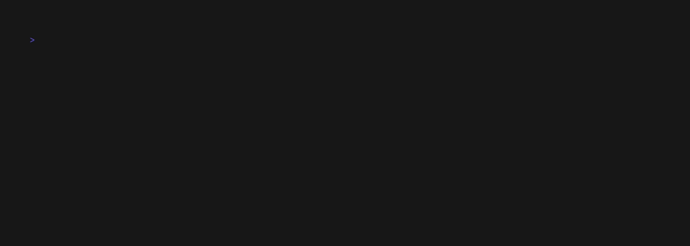

# 📝 todo-app

Uma CLI simples para gerenciar tarefas do dia a dia, construída em **Go** com [Cobra](https://github.com/spf13/cobra).




## ✨ Funcionalidades

- ➕ Adicionar uma ou várias tarefas de uma vez
- 📋 Listar todas as tarefas em uma tabela colorida no terminal
- ✅ Marcar tarefas como concluídas
- 🗑️ Remover tarefas específicas por ID, ou todas de uma vez
- 💾 Persistência automática em disco — os dados continuam lá mesmo depois de fechar o terminal

## 📦 Instalação

### Pré-requisitos

- Go 1.27 ou superior instalado

### Compilando a partir do código-fonte

Faça o clone do repositório e logo em seguida o build do projeto. Caso queira, use a flag `-o` para nomeáo-lo do jeito que preferir.

```bash
git clone https://github.com/gustavop-fausto/todo-app.git
cd todo-app
go build -o todo
```

Depois do build, basta rodá-lo:

```go
./todo --help
```

## 🚀 Uso

### Adicionar tarefas

```bash
todo add "Fazer um cafézinho"
todo add "Fazer um cafézinho" "Sair com os amigos" "Aprender uma música nova no violão"
```

Você pode adicionar uma ou várias tarefas de uma vez, cada uma como um argumento separado.

### Listar tarefas

```bash
todo list
```

Exibe todas as tarefas cadastradas em uma tabela, com o status de conclusão de cada uma.

### Marcar como concluída

```bash
todo done 1
todo done 1 2 3
```

Você também pode marcar mais de uma tarefa como concluída de uma vez.

### Remover tarefas

```bash
todo remove 2
todo remove 2 3 5
todo remove --all
todo remove -a
```

## 🛠️ Tecnologias

- [Go](https://go.dev/)
- [Cobra](https://github.com/spf13/cobra) — construção da CLI
- [aquasecurity/table](https://github.com/aquasecurity/table) — renderização da tabela no terminal
- [liamg/tml](https://github.com/liamg/tml) — cores no terminal
- [vhs](https://github.com/charmbracelet/vhs) — gifs no terminal

## 📄 Licença

Este projeto está sob a licença especificada no arquivo [LICENSE](./LICENSE).
